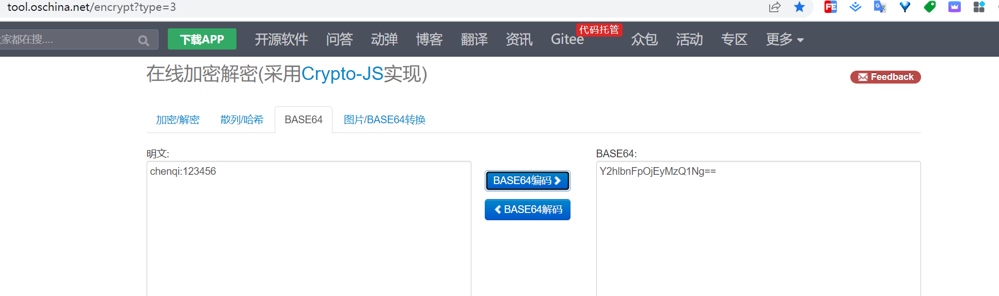
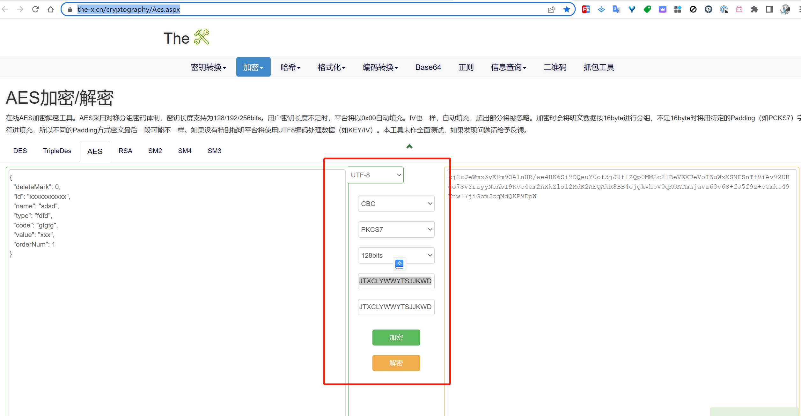

# 环境说明

## 主要

* 非必要情况下不要改动application-dev和application-prod ! 改了也不要上传至git库 ！*

## 配置mysql相关的环境变量(如果是windows就是此电脑->配置->系统属性->环境变量，记得加完之后需要执行使其生效。CenterOs在etc/profile)

### 语法说明

如`${WWYT_MYSQL_USER_DEV:root}`的意思是先去找环境变量中的`WWYT_MYSQL_USER_DEV`
如果找不到则会使用root。所以下面的所有变量其实真正需要配置的只有和你连接配置中不一致的部分。并不是所有都需要配置。

### 开发环境，添加如下环境变量

`WWYT_MYSQL_USER_DEV`:你开发时连接的mysql用户名，如果是默认的`root`可以不加。

`WWYT_MYSQL_PWD_DEV`:你开发时连接的mysql密码。

`WWYT_MYSQL_HOST_DEV`:你开发时连接的mysql的服务器地址 *或(注意是或)* 在host中配置`wwyt-mysql`解析的ip地址。

`WWYT_MYSQL_PORT_DEV`:你开发时连接的mysql的端口，如果是默认的`3306`可以不加。

`WWYT_MYSQL_DB_DEV`:你开发时连接的mysql的表名，如果是默认的`jt-prod`可以不加。

### 生产环境，添加如下环境变量

`WWYT_MYSQL_USER_PROD`:部署的服务器时连接的mysql用户名，如果是默认的`root`可以不加。

`WWYT_MYSQL_PWD_PROD`:部署的服务器时连接的mysql密码。

`WWYT_MYSQL_HOST_PROD`:部署的服务器时连接的mysql的服务器地址 *或(注意是或)* 在host中配置`wwyt-mysql`解析的ip地址。

`WWYT_MYSQL_PORT_PROD`:部署的服务器时连接的mysql的端口，如果是默认的`3306`可以不加。

`WWYT_MYSQL_DB_PROD`:部署的服务器时连接的mysql的表名，如果是默认的`jt-prod`可以不加。

## 配置redis相关的环境变量

### 开发环境

`WWYT_REDIS_DB_DEV`:你开发时连接的redis的database。

`WWYT_REDIS_HOST_DEV`:你开发时连接的redis的服务器地址 *或(注意是或)* 在host中配置`wwyt-redis`解析的ip地址。

`WWYT_REDIS_PWD_DEV`:你开发时连接的redis密码。

`WWYT_REDIS_PORT_DEV`:你开发时连接的redis的端口，如果是默认的`6379`可以不加。

### 生产环境

`WWYT_REDIS_DB_PROD`:生成部署时连接的redis的database。

`WWYT_REDIS_HOST_PROD`:生成部署时连接的redis的服务器地址 *或(注意是或)* 在host中配置`wwyt-redis`解析的ip地址。

`WWYT_REDIS_PWD_PROD`:生成部署时连接的redis密码。

`WWYT_REDIS_PORT_PROD`:生成部署时连接的redis的端口，如果是默认的`6379`可以不加。

## 接口授权说明

每个接口由Header中Authorization的Basic 传输，和文档一致

### 在线加解密

https://tool.oschina.net/encrypt?type=3

## 接口数据体加密说明

除了修改了秘钥和偏移量，其他和文档一致
秘钥和偏移量现在都为`JTXCLYWWYTSJJKWD`

### 在线加解密

https://the-x.cn/cryptography/Aes.aspx

## 系统权限说明

考虑到后续会有页面将企业已经上传的数据展示给企业，所以系统默认集成权限系统，根据各表中都有的`create_by`字段过滤企业查询数据
示例，以用户`chenqi`查询数据时只会出现create_by中为chenqi的所有数据

## 时间格式化说明

文档中主要时间格式为`yyyyMMddHHmmss` 所以接口交互时所有LocalDateTime格式的时间将会转为`yyyyMMddHHmmss`
，所有LocalDate格式的时间将会转为`yyyyMMdd`。无论传入还是返回
